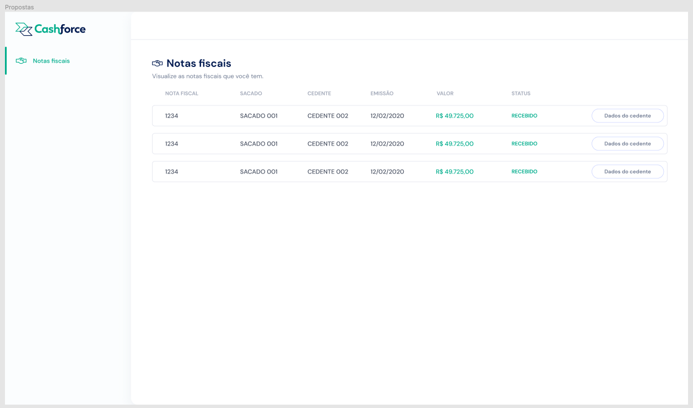

# Cashforce

## Teste Técnico Cashforce

Estruturar uma aplicação web fullstack, a partir do banco de dados disponibilizado onde o objetivo é consumir os dados de uma API criada e informar no front end, conforme protótipo abaixo:
 
 
O banco de dados dessa aplicação está dockerizado, portanto, para executá-la é necessário ter as seguintes ferramentas instaladas: <br>

<a href="https://git-scm.com/book/en/v2/Getting-Started-Installing-Git">Git</a><br>
<a href="https://docs.docker.com/get-docker/">Docker</a><br>
<a href="https://docs.docker.com/compose/install/">Docker-Compose</a><br>

Será necessário também que as portas 3001 (API) e 8080 (Front End) estejam disponíveis para a aplicação.
<br>
<hr> 
<br>
<details>
  <summary>
  <strong>🛠 Ferramentas:</strong>
  </summary> <br>
  
  <summary>
  <strong>Front End:</strong>
  </summary>
  <a href="https://vuejs.org/guide/introduction.html">Vue</a><br>
  <a href="https://www.javascript.com/">JavaScript</a><br>
  <a href="https://axios-http.com/ptbr/docs/intro">Axios</a><br>
  <a href="https://date-fns.org/">Date-fns</a><br>
<br>
 <summary>
 <strong>Back End:</strong>
 </summary>
 <a href="https://nodejs.org/pt-br/">Node</a><br>
 <a href="https://www.javascript.com/">JavaScript</a><br>
 <a href="https://expressjs.com/pt-br/">Express</a><br>
 <a href="https://sequelize.org/">Sequelize</a><br>
 <a href="https://github.com/sequelize/sequelize-auto">Sequelize Auto</a><br>
 <a href="https://developer.mozilla.org/pt-BR/docs/Web/HTTP/CORS">Cors</a><br>
 <a href="https://www.mysql.com/">MySQL</a><br>
 <a href="https://www.npmjs.com/package/http-status-codes">HTTP Status Codes</a><br>
 <br>
 <summary>
 <strong>Teste da API:</strong>
 </summary>
 <a href="https://www.chaijs.com/">Chai</a><br>
 <a href="https://sinonjs.org/">Sinon</a><br>
 <a href="https://mochajs.org/">Mocha</a><br>
 
 </details>


 <details>
 <summary>
 <strong>💻 Como executar a aplicação:</strong>
 </summary><br>

 1. Clone o repositório

  - Use o comando: `git clone git@github.com:brunomourabastos/cashforce.git`.
    - Entre na pasta do repositório que você acabou de clonar, use o comando `cd cashforce`.
 
 2. Instale as dependências

  - Dentro da pasta cashforce, use o comando: `npm run install:all`.
    - Aguarde a instalação das dependências. Nessa etapa serão instaladas as dependências do backend e frontend.

 3. Inicialistar docker e docker-compose:
 
  - Dentro da pasta cashforce, use o comando: `npm run start:docker`.
    - Nessa etapa, é necessário o docker aberto e funcionando.

 4. Criar e popular o banco de dados:
 
  - Dentro da pasta cashforce, use o comando: `npm run start:db`.
    - Aguarde até que a operação seja finalizada.
 
 5. Iniciar API:
 
  - Dentro da pasta cashforce, use o comando: `npm run start:api`.
    - Aguarde que a mensagem `API rodando na porta 3001` apareça
    <details>
      <summary>Deve aparecer uma imagem conforme abaixo:</summary>
      
    </details>
 
 6. Iniciar Front End:
 
  - Abra um novo terminal.
    - Acesse a pasta `cashforce` (mesma dos passos anteriores).
      - Use o comando `npm run start:app`.
      <details>
        <summary>Deve aparecer uma imagem conforme abaixo:</summary>
        
      </details>
      
 <strong>Com isso, teremos a API, rodando em localhost:3001 e a exibição no front end em localhost:8080.</strong>
 
 </details>

<details>
<summary>
<strong>🕵🏿 Como testar a API</strong>
</summary><br>

 1. Com a API em funcionanmento:

  - Na pasta `cashforce` (mesma dos passos anteriores), use o comando: `run test:api`.
    <details>
      <summary>Deve aparecer uma imagem conforme abaixo:</summary>
      
    </details>
 
Para testar a API:
 
 - Com a API em funcionamento, entre na pasta cashforce (mesma dos passos anteriores) e utilize o comando npm run test:api, a informação abaixo deve ser exibida:
</details>
<br>
<hr>
 
## Rotas API:
 
 - Para esse projeto, foi necessário utilizar somente uma rota, porém a aplicação está pronta para ser escalada, caso haja necessidade:

 |  |   |
 | :-------: | :-------- |
 | `Método`   | GET |
 | `Funcionalidade`    | Requisição de todas as orders cadastradas no banco de dados |
 | `URL`   | http://localhost:3001/orders |
 |  |   |
 
 <details>
  <summary>
    Essa rota, inicialmente, retorna o seguinte JSON:
   </summary>

 ```json
 [
    {
        "id": 1,
        "orderNfId": "1605181324132",
        "orderNumber": "18153",
        "orderPath": "",
        "orderFileName": "",
        "orderOriginalName": "",
        "emissionDate": "2020-10-30T11:00:00-03:00",
        "pdfFile": "",
        "emitedTo": "22843980000127",
        "nNf": "18153",
        "CTE": "",
        "value": "198450",
        "cnpjId": 1,
        "userId": 1,
        "buyerId": 1,
        "providerId": 1,
        "orderStatusBuyer": "0",
        "orderStatusProvider": "0",
        "deliveryReceipt": "",
        "cargoPackingList": "",
        "deliveryCtrc": "",
        "createdAt": "2020-10-30T17:54:18.000Z",
        "updatedAt": "2020-10-30T17:54:18.000Z",
        "cnpj": {
            "cnpj": "00000000000001"
        },
        "user": {
            "name": "ALLAN SOUZA"
        },
        "buyer": {
            "name": "SACADO 001"
        },
        "provider": {
            "name": "CEDENTE 002"
        }
    },
    {
        "id": 2,
        "orderNfId": "160518132413",
        "orderNumber": "18157",
        "orderPath": "",
        "orderFileName": "",
        "orderOriginalName": "",
        "emissionDate": "2020-11-04T15:32:35-02:00",
        "pdfFile": "",
        "emitedTo": "35705180000272",
        "nNf": "18157",
        "CTE": "",
        "value": "168850",
        "cnpjId": 1,
        "userId": 1,
        "buyerId": 1,
        "providerId": 1,
        "orderStatusBuyer": "0",
        "orderStatusProvider": "0",
        "deliveryReceipt": "",
        "cargoPackingList": "",
        "deliveryCtrc": "",
        "createdAt": "2020-11-10T18:33:46.000Z",
        "updatedAt": "2020-11-10T18:33:46.000Z",
        "cnpj": {
            "cnpj": "00000000000001"
        },
        "user": {
            "name": "ALLAN SOUZA"
        },
        "buyer": {
            "name": "SACADO 001"
        },
        "provider": {
            "name": "CEDENTE 002"
        }
    },
    {
        "id": 3,
        "orderNfId": "1605181324130",
        "orderNumber": "18184",
        "orderPath": "",
        "orderFileName": "",
        "orderOriginalName": "",
        "emissionDate": "2020-11-10",
        "pdfFile": "",
        "emitedTo": "00418477002640",
        "nNf": "18184",
        "CTE": "",
        "value": "222795",
        "cnpjId": 1,
        "userId": 1,
        "buyerId": 1,
        "providerId": 1,
        "orderStatusBuyer": "7",
        "orderStatusProvider": "3",
        "deliveryReceipt": "",
        "cargoPackingList": "",
        "deliveryCtrc": "",
        "createdAt": "2020-11-12T11:42:06.000Z",
        "updatedAt": "2020-11-18T12:22:14.000Z",
        "cnpj": {
            "cnpj": "00000000000001"
        },
        "user": {
            "name": "ALLAN SOUZA"
        },
        "buyer": {
            "name": "SACADO 001"
        },
        "provider": {
            "name": "CEDENTE 002"
        }
    }
]
``` 
</details>

<hr>

# Front End:

Para ter acesso ao Front End da aplicação, siga as orientações e acesse o endereço: ` http://localhost:8080/ `

<strong>A página inicial mostrará já a aplicação em funcionamento, informando os dados, conforme protótipo.<strong>
  <details>
    <summary>Protótipo</summary>
    
  </details>

<strong>A aplicação final deve estar igual a imagem abaixo:</strong>
  <details>
    <summary>Aplicação final</summary>
    
  </details>
 
